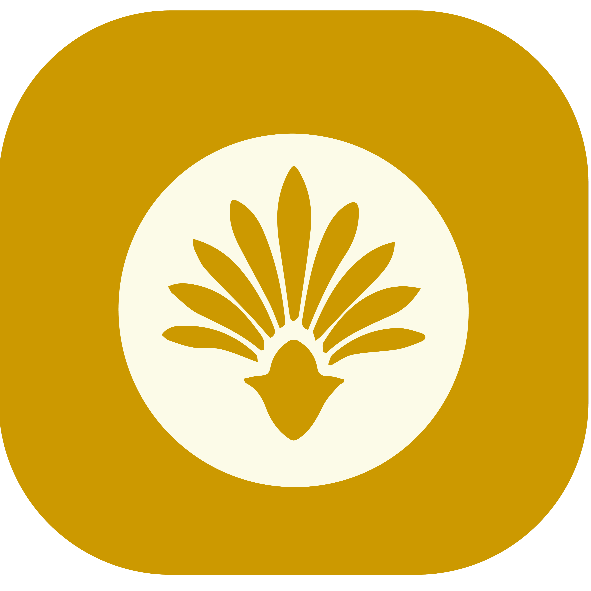
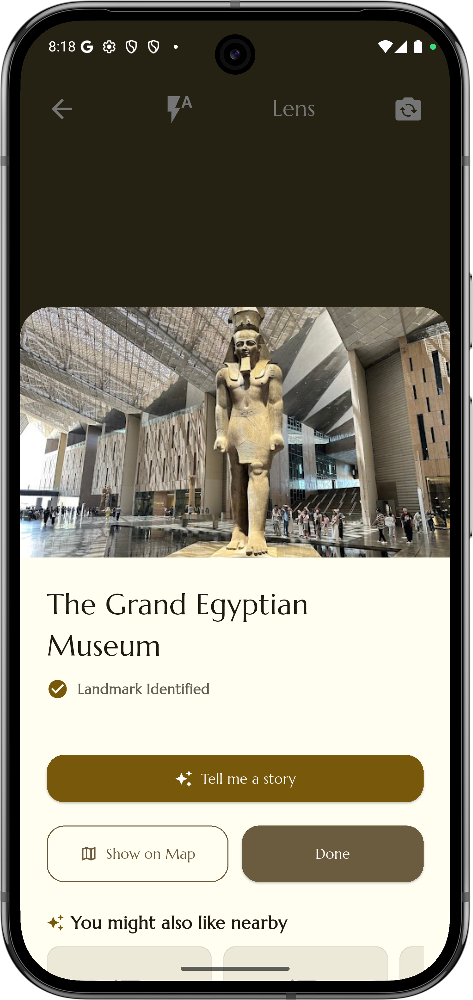
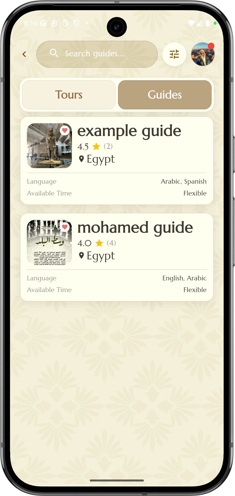
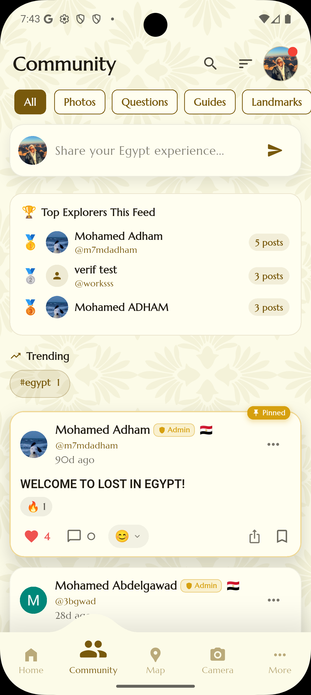
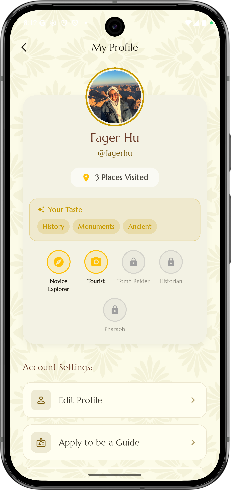
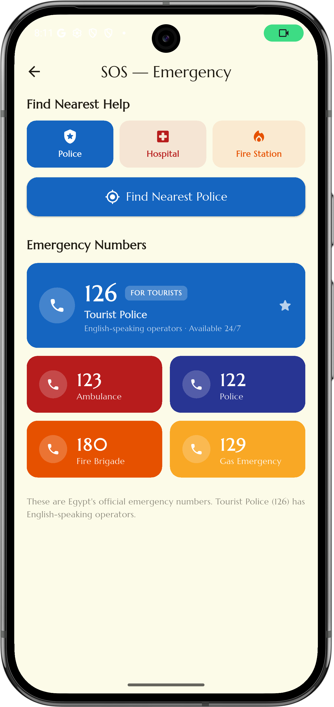
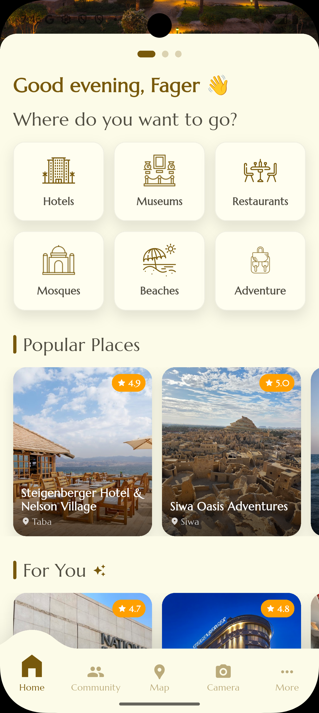
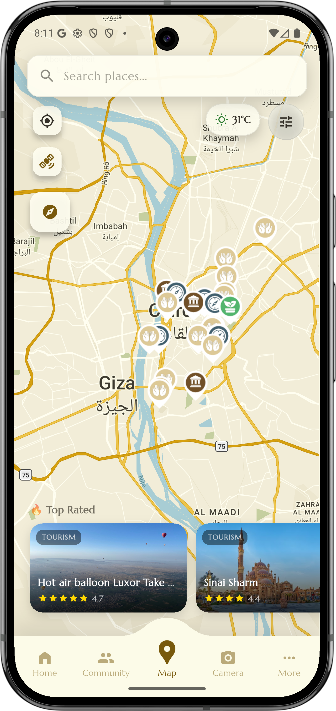
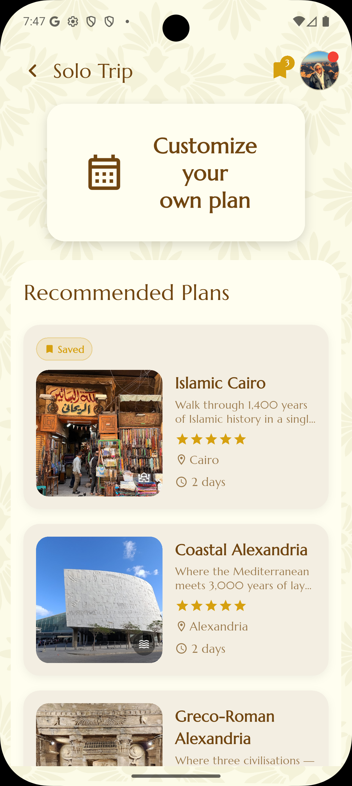

<p align="center">
  
</p>

<p align="center">
  
</p>

<h1 align="center">🇪🇬 Lost in Egypt</h1>

<p align="center">
  <b>A Smart AI-Powered Tourism Platform Built with Flutter</b>
</p>

<p align="center">
  
  
  
  
  
</p>

---

# 🇪🇬 Lost in Egypt (Flutter)

A smart travel companion app built with Flutter to help tourists and local travelers explore Egypt with less confusion, better planning, and smarter discovery.

The app brings together maps, AI landmark recognition, personalized recommendations, tour booking, guide support, community posts, notifications, localization, payments, and Firebase backend services in one mobile experience.

---

## 🌟 Project Vision

Lost in Egypt was developed to simplify tourism in Egypt by bringing every essential travel service into one intelligent mobile application.

Instead of relying on multiple applications for maps, recommendations, translation, tour booking, guides, and travel planning, users can access everything through one platform.

The project combines Artificial Intelligence, Google Maps, Firebase Cloud Services, and modern mobile technologies to deliver a seamless and personalized travel experience for both tourists and local explorers.

The main idea behind the project is to make tourism in Egypt easier, safer, and more organized by giving users one application that can help them discover places, understand landmarks, book tours, interact with guides, share experiences, and receive useful travel suggestions.

---

## 📸 Screenshots

| AI Camera | Tours | Community | Profile |
|-----------|-------|-----------|---------|
|  |  |  |  |

| SOS Emergency | Home | Map | Solo Trip |
|---------------|------|-----|-----------|
|  |  |  |  |

---

## 🎥 Demo

<p align="center">
  
</p>

<p align="center">
  <a href="assets/screenshot/demo.mp4">
    <b>▶️ Watch the Full Demo Video</b>
  </a>
</p>

---

## 🚀 Features

### 🔐 Authentication

- Email and password login/register
- Google Sign-In
- Facebook login support
- Firebase Authentication
- Auth gate flow to route users based on login state
- User-specific data linked with Firebase services
- Secure login and registration using email and password
- Social login with Google and Facebook for faster access
- Firebase Authentication ensures secure user management
- Persistent sessions for seamless user experience

---

### 🗺️ Smart Map

- Google Maps integration
- Current location support using GPS
- Landmark markers and place discovery
- Search and category-based map exploration
- Custom light and dark map styles
- Map actions from notifications and discovery features
- Offline/fallback landmark data using bundled assets
- Fully integrated Google Maps for real-time navigation
- Displays nearby landmarks, attractions, and services
- Custom markers for different categories such as restaurants, museums, hotels, and more
- Supports both light and dark map themes

---

### 🧭 Personalized Recommendations

- Suggests places based on user interests and travel preferences
- Supports categories like museums, restaurants, hotels, beaches, mosques, adventure places, and historical landmarks
- Uses bundled recommendation data and place datasets
- Helps users avoid random searching across multiple apps
- Helps users discover hidden gems and popular destinations
- Reduces planning time by offering curated suggestions

---

### 📸 AI Camera & Landmark Understanding

The AI feature helps users understand places, signs, landmarks, and travel information through the camera.

- Camera and image picker support
- AI-assisted image analysis
- Landmark/image understanding flow
- Google ML Kit text recognition
- Google ML Kit translation support
- Gemini AI integration using `google_generative_ai`
- Image processing support
- Useful for tourists who want quick information about a place without needing to search manually
- Allows users to capture or upload images of landmarks
- Uses AI to identify locations and provide relevant information
- Supports text recognition from signs and documents using ML Kit
- Gemini AI enhances understanding and contextual responses

This feature is designed to make the app feel like a smart travel assistant. A user can take or upload an image, then the app can help extract text, understand context, translate information, or provide AI-powered guidance.

---

### 🌍 Language & Translation

- English and Arabic localization
- RTL layout support for Arabic
- Cairo font for Arabic UI
- Marcellus font for the Egyptian-style design
- Translation-related packages for multilingual travel support
- Better experience for both tourists and local users
- Smooth switching between languages without restarting the app

---

### 🗣️ Voice Support

- Speech-to-text support
- Text-to-speech support
- Helpful for travelers who prefer voice input or audio guidance
- Useful while walking, navigating, or when typing is inconvenient

---

### 👥 Community

- Community section for user travel posts
- Users can share experiences, tips, and recommendations
- Helps travelers discover real opinions from other users
- Supports a more social travel experience
- Users can post photos, reviews, and travel experiences
- Like, comment, and interact with other travelers
- Builds a social travel network inside the app

---

### 🧑‍💼 Tours & Guides

- Tour browsing structure
- Tour booking flow support
- Guide application feature
- Map picker support for tour locations
- Review/rating support
- QR code generation and scanning
- Paymob payment integration for paid tours or guide services
- Browse available tours with detailed descriptions and pricing
- Apply to become a tour guide through a dedicated feature
- Select locations using an interactive map picker

---

### 🚨 SOS Emergency

- Emergency support screen for urgent situations
- Helps users quickly access important emergency-related actions
- Designed to improve traveler safety
- Useful for tourists who may not know local emergency contacts or nearby help options

---

### 🧳 Solo Trip

- Solo trip support for users traveling alone
- Helps users organize their trip experience
- Supports safer and more personalized travel planning
- Designed for tourists or locals who want to explore independently

---

### 🔔 Notifications

- Firebase Cloud Messaging
- Local notifications
- Daily discovery notification flow
- Foreground and background notification handling
- FCM token update linked to authenticated users
- Notifications can guide users back to map or discovery features
- Real-time push notifications using Firebase Cloud Messaging
- Local notifications for reminders and updates
- Daily suggestions for new places to explore
- Alerts for bookings, messages, and important updates

---

### 🌙 UI/UX

- Light and dark theme support
- Material 3 style
- Responsive UI using `flutter_screenutil`
- Custom icons, fonts, pins, images, and map styles
- Cached network images for better performance
- Clean and modern design inspired by Egyptian culture
- Fully responsive layout across different screen sizes
- Smooth animations and transitions
- Optimized performance for a fast and fluid experience

---

### 📶 Offline & Caching

- Firestore offline persistence
- Unlimited Firestore cache setting
- Bundled landmark/place assets
- Cached images
- Connectivity-aware behavior
- Optional switch to disable live Places API and rely on local data
- Offline fallback data ensures usability even with limited internet

---

## ☁️ Backend Architecture

The app uses Firebase as the main backend layer, with several cloud services connected together.

Lost in Egypt uses a cloud-based backend built on Firebase to handle authentication, data storage, media storage, notifications, real-time updates, and server-side logic. This allows the Flutter application to focus on the user experience while Firebase manages the backend infrastructure.

The backend was designed to support scalability, security, and real-time interaction between users, guides, community posts, tours, and notifications.

---

### 🔐 Firebase Authentication

Firebase Authentication handles user identity and secure access to the app.

It supports:

- Email and password authentication
- Google Sign-In
- Facebook login
- Persistent user sessions
- Auth state checking
- Secure identity management
- Routing users based on login state

Authentication is important because many features depend on knowing the current user, such as community posts, bookings, guide applications, reviews, saved places, and notifications.

---

### 🗄️ Cloud Firestore

Cloud Firestore is used as the main database for the project.

It can store and manage:

- User profiles
- Community posts
- Reviews and ratings
- Tours
- Tour guide applications
- Favorite places
- Bookings
- Place data
- Recommendation data
- Notification-related user data
- User preferences

Firestore also supports offline persistence, which improves the experience when the internet connection is weak or unavailable. Previously loaded data can still be available even when the user is offline.

---

### ⚡ Firebase Realtime Database

Firebase Realtime Database is used for information that needs fast synchronization.

It can support:

- Real-time updates
- Fast data changes
- Live status features
- Event-based updates
- Data that needs to appear instantly across devices

Using Realtime Database together with Firestore gives the project flexibility. Firestore is better for structured app data, while Realtime Database can be useful for faster real-time interactions.

---

### 🖼️ Firebase Storage

Firebase Storage is used for uploaded files and media.

It can store:

- Profile images
- Community post images
- Tour images
- Landmark images
- Guide-related documents or media
- Other user-generated media

This keeps large files outside the main database and makes the app more organized and scalable.

---

### 🔔 Firebase Cloud Messaging

Firebase Cloud Messaging is used for push notifications.

It supports:

- Daily discovery notifications
- Booking updates
- Community updates
- Guide-related notifications
- Important app alerts
- Foreground notifications
- Background notifications
- FCM token refresh and user linking

Notifications help keep users engaged and can guide them back to important app features like the map, tours, or daily recommendations.

---

### 🧩 Firebase Cloud Functions

The repository includes a `functions/` backend folder for server-side logic.

Cloud Functions can be used for:

- Recommendation synchronization
- Event processing
- Notification triggers
- Secure backend operations
- Scheduled tasks
- Server-side validation
- Future external API integrations
- Keeping sensitive logic away from the Flutter client

Using Cloud Functions improves security because important backend logic does not need to run directly inside the mobile app.

---

### 🧠 Backend Responsibilities

The backend is responsible for:

- Managing authentication state
- Storing and retrieving user data
- Supporting community posts and reviews
- Handling tour and guide-related data
- Supporting notification workflows
- Updating and syncing FCM tokens
- Providing backend logic for recommendation and event synchronization
- Keeping sensitive operations outside the Flutter client when needed
- Managing uploaded media through Firebase Storage
- Supporting real-time and offline-friendly app behavior

The backend helps keep the app scalable because the Flutter app focuses on the user interface while Firebase handles authentication, data storage, notifications, media, and server-side logic.

---

## 🤖 AI Features in Detail

The AI side of Lost in Egypt focuses on helping users understand Egypt around them faster.

The AI system combines Gemini, ML Kit, camera access, image picker, image processing, speech-to-text, and text-to-speech to make the app act like a smart travel assistant.

---

### 1. AI Camera Recognition

Users can open the camera or choose an image from their gallery. The app can then process the image and help identify useful information.

Possible use cases:

- Recognizing landmark-related content
- Reading signs, tickets, menus, or boards
- Helping tourists understand what they are looking at
- Extracting text from images
- Sending image/text context to AI for smarter responses
- Explaining tourist places based on the image or text context
- Supporting users who do not know the name of a place

---

### 2. ML Kit Text Recognition

The app uses Google ML Kit Text Recognition to extract text from images.

This is useful for:

- Reading signs
- Reading museum boards
- Reading travel instructions
- Reading menus
- Reading tickets
- Extracting Arabic and English text from images

---

### 3. ML Kit Translation

Translation support can help users understand text in another language, especially tourists who may not understand Arabic.

It can be useful for:

- Translating signs
- Translating menus
- Translating museum descriptions
- Translating travel instructions
- Helping tourists understand local written information

---

### 4. Gemini AI

The app uses Gemini AI through `google_generative_ai`.

Gemini can support:

- Explaining landmarks
- Giving travel suggestions
- Helping users understand image or text context
- Creating a smarter assistant-like experience inside the app
- Answering tourism-related questions
- Generating personalized recommendations
- Supporting trip planning ideas

Gemini is useful because ML Kit can extract or translate information, while Gemini can understand context and give a more human-like explanation.

---

### 5. Voice AI Support

The app includes both:

- `speech_to_text`
- `flutter_tts`

This can support voice input and spoken responses, making the travel assistant easier to use while walking, moving, or navigating.

Voice support can help users:

- Ask questions without typing
- Hear travel information
- Use the app while walking
- Get help faster during a trip

---

## 🛠️ Tech Stack

- **Framework:** Flutter / Dart
- **Architecture:** Clean Architecture + Feature-based structure
- **State Management:** flutter_bloc, Provider, ValueNotifier
- **Dependency Injection:** GetIt
- **Backend:** Firebase
- **Database:** Cloud Firestore, Firebase Realtime Database
- **Storage:** Firebase Storage
- **Authentication:** Firebase Auth, Google Sign-In, Facebook Auth
- **Notifications:** Firebase Cloud Messaging, Flutter Local Notifications
- **Maps & Location:** Google Maps Flutter, Geolocator, Geocoding
- **AI / ML:** Gemini API, Google ML Kit, Camera, Image Picker
- **Payments:** Paymob
- **QR:** QR generation and mobile scanner
- **Localization:** English / Arabic with RTL support
- **Utilities:** Shared Preferences, Cached Network Image, Connectivity Plus, PDF, Printing, Share Plus

---

## 🧱 System Architecture

```text
                   Flutter Mobile App
                          │
        ┌─────────────────┼─────────────────┐
        │                 │                 │
        ▼                 ▼                 ▼
  Google Maps       Firebase Auth       AI Services
        │                 │                 │
        ▼                 ▼                 ▼
 Location APIs      Cloud Firestore      Gemini API
        │                 │                 │
        ▼                 ▼                 ▼
 Map Styling        Cloud Functions      Google ML Kit
        │                 │                 │
        ▼                 ▼                 ▼
 Place Data         Firebase Storage     Camera / Image Picker
                          │
                          ▼
                Firebase Cloud Messaging
                          │
                          ▼
                    Local Notifications
```

---

## 📂 Project Structure

```plaintext
lost_in_egypt/
├── android/
├── ios/
├── web/
├── windows/
├── assets/
├── functions/
├── lib/
│   ├── core/
│   │   ├── constants/
│   │   ├── di/
│   │   ├── error/
│   │   ├── models/
│   │   ├── services/
│   │   ├── utils/
│   │   └── widgets/
│   ├── feature/
│   │   ├── admin/
│   │   ├── auth/
│   │   ├── guide_application/
│   │   ├── home/
│   │   ├── onboarding/
│   │   ├── reviews/
│   │   └── tours/
│   ├── l10n/
│   ├── theme/
│   ├── firebase_options.dart
│   └── main.dart
├── firebase.json
├── firestore.rules
├── storage.rules
├── database.rules.json
├── pubspec.yaml
└── README.md
```

Most major features follow this structure:

```plaintext
feature_name/
├── data/
├── domain/
└── presentation/
```

---

## 🌐 APIs & Services Used

- 🔹 Firebase Authentication
- 🔹 Cloud Firestore
- 🔹 Firebase Storage
- 🔹 Firebase Cloud Messaging
- 🔹 Firebase Realtime Database
- 🔹 Firebase Cloud Functions
- 🔹 Google Maps Platform
- 🔹 Gemini API
- 🔹 Google ML Kit
- 🔹 Paymob Payment Gateway

---

## ⚙️ Installation

### 1. Clone the repo

```bash
git clone https://github.com/fagerhu03/lost_in_egypt.git
cd lost_in_egypt
```

### 2. Install dependencies

```bash
flutter pub get
```

### 3. Setup Firebase

- Create a Firebase project
- Add Android, iOS, and Web apps
- Download and add the needed Firebase configuration files
- Enable Firebase Authentication
- Enable Firestore
- Enable Firebase Storage
- Enable Realtime Database
- Enable Cloud Messaging
- Deploy Cloud Functions if backend functions are required

### 4. Setup environment variables

Create a `.env` file in the project root:

```env
GOOGLE_MAPS_API_KEY=your_google_maps_api_key
GEMINI_API_KEY=your_gemini_api_key
PLACES_API_DISABLED=false
PAYMOB_API_KEY=your_paymob_api_key
PAYMOB_INTEGRATION_ID_CARD=your_card_integration_id
PAYMOB_INTEGRATION_ID_WALLET=your_wallet_integration_id
PAYMOB_IFRAME_ID=your_iframe_id
```

> Do not commit real API keys to GitHub.

### 5. Run the app

```bash
flutter run
```

For a specific platform:

```bash
flutter run -d chrome
flutter run -d android
flutter run -d ios
```

---

## 📌 Main Dependencies

```yaml
dependencies:
  flutter:
    sdk: flutter

  # Firebase
  firebase_core:
  firebase_auth:
  cloud_firestore:
  firebase_storage:
  firebase_messaging:
  firebase_database:

  # Authentication
  google_sign_in:
  flutter_facebook_auth:

  # Maps & Location
  google_maps_flutter:
  geolocator:
  geocoding:

  # State Management & Architecture
  flutter_bloc:
  provider:
  get_it:
  equatable:

  # AI / ML
  google_generative_ai:
  google_mlkit_text_recognition:
  google_mlkit_translation:
  camera:
  image_picker:
  image:

  # Notifications
  flutter_local_notifications:

  # UI / UX
  flutter_screenutil:
  cached_network_image:
  flutter_svg:
  shared_preferences:

  # Payments, QR, Sharing
  pay_with_paymob:
  qr_flutter:
  mobile_scanner:
  pdf:
  printing:
  share_plus:

  # Voice
  speech_to_text:
  flutter_tts:

  # Utilities
  connectivity_plus:
  flutter_dotenv:
  url_launcher:
  timeago:
  intl:
```

---

## 🧪 Testing

Run tests with:

```bash
flutter test
```

The project includes testing tools like `bloc_test` and `mocktail`.

---

## 🗺️ Map Data & Assets

The app includes local assets for places, recommendations, map styles, fonts, and icons.

Examples:

- `assets/final_places_clean_v2.json`
- `assets/map_style.json`
- `assets/darkmode_map_style.json`
- Category data for hotels, restaurants, museums, mosques, beaches, and adventure places
- Custom pins and icons
- Arabic and English fonts

There is also a developer switch:

```env
PLACES_API_DISABLED=true
```

When enabled, the app can avoid live Places API calls and rely more on bundled/cached data.

---

## 💳 Payment Support

The app includes Paymob setup for tour booking or guide-related payment flows.

Required environment variables:

```env
PAYMOB_API_KEY=
PAYMOB_INTEGRATION_ID_CARD=
PAYMOB_INTEGRATION_ID_WALLET=
PAYMOB_IFRAME_ID=
```

---

## 🧠 What Makes Lost in Egypt Useful

Traveling in Egypt can be confusing when users have to depend on different apps for maps, translation, recommendations, reviews, tour guides, and booking.

Lost in Egypt brings these tools together in one place.

The app focuses on:

- Helping users avoid getting lost
- Making landmark discovery easier
- Supporting Arabic and English users
- Giving personalized travel suggestions
- Using AI to identify or explain places
- Connecting users with guides, tours, and community knowledge
- Making the experience more reliable through offline data and caching

---

## 📌 Future Improvements

- Add more verified tour guides
- Improve recommendation ranking with more user behavior data
- Add full offline trip planning
- Add hotel and restaurant booking integrations
- Add emergency tourist support features
- Add AR landmark recognition
- Add more governorates and hidden-gem destinations
- Add saved trips and itinerary sharing
- Add offline AI travel assistant
- Add AI itinerary generation
- Add smart crowd detection
- Add voice-based multilingual assistant

---

## 🎓 Academic Information

**Project Title:** Lost in Egypt

**Project Type:** Graduation Project

**University:** Misr University for Science and Technology (MUST)

**Faculty:** Faculty of Engineering

**Department:** Computer Engineering

**Academic Year:** 2025 – 2026

---

## 🤝 Contributors

- [Fager Hussein Ahmed](https://github.com/fagerhu03)
- [Mohamed Adham](https://github.com/M7mdA13)
- [Menatallah Khaled](https://github.com/menaaly)
- [Shaza Mohamed](https://github.com/shaza-hue)
- [Mohamed abdelgawad](https://github.com/Mzdo25)
- [Alaa Hassan](https://github.com/a91e7)

---

## 🙏 Acknowledgements

Special thanks to everyone who contributed to building Lost in Egypt and supporting the project idea.

Special thanks to Misr University for Science and Technology (MUST), the Faculty of Engineering, and everyone who supported the development of this graduation project.

---

## 📬 Contact

**Project:** Lost in Egypt  
**GitHub:** [fagerhu03/lost_in_egypt](https://github.com/fagerhu03/lost_in_egypt)

---

💡 Built with ❤️ using Flutter.
